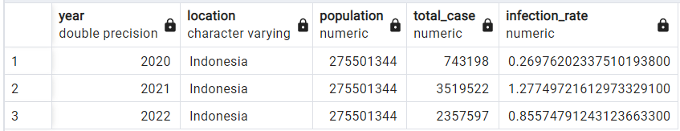

# 🌏 SQL Data Exploration: Analyzing Covid-19 in Indonesia

> **Tools** : PostgreSQL

## 🔎 Objective
Menganalisa data Covid-19 untuk menemukan insight, khususnya untuk mencari informasi mengenai kasus yang terkonfirmasi dan vaksinasi yang ada di Indonesia.

## 🔎 Dataset
Data covid Covid-19 dari 4 Februari 2020 hingga 22 November 2022 dari [Our World in Data](https://ourworldindata.org/covid-deaths). Dataset dibagi dalam 2 file csv yang meliputi :
- covid19_deaths.csv — berisi *record* kasus dan kematian Covid-19 di seluruh dunia
- covid19_vaccination.csv — berisi *record* vaksinasi Covid-19 di seluruh dunia

## 🔎 Analysis
### Total Cases, Total Deaths, & Death Rate by Country and Date
**1. Worldwide - Total Cases, Total Deaths, & Death Rate by Country and Date**
```
SELECT 
    location, 
    date, 
    total_cases, 
    total_deaths,
	(total_deaths/total_cases)*100 AS death_rate
FROM covid_deaths
WHERE continent IS NOT null
ORDER BY 1, 2
```
<p align="center">
	<kbd> </kbd> <br>
	Gambar 1 — Death Rate merepresentasikan kemungkinan kematian akibat Covid-19. Dapat di lihat di Afghanistan kematian akibat Covid-19 mulai terjadi pada hari ke-29.
</p>

**2. Indonesia - Total Cases, Total Deaths, & Death Rate by Country and Date**
```
SELECT 
	location, 
	date, 
	total_cases, 
	total_deaths,
	(total_deaths/total_cases)*100 AS death_rate
FROM covid_deaths
WHERE LOCATION LIKE 'Indonesia'
ORDER BY 1, 2
```
<p align="center">
	<kbd> </kbd> <br>
	Gambar 2 — Kematian akibat Covid-19 di Indonesia mulai terjadi pada hari ke-10 setelah kasus pertama dimulai.
</p> <br>

**3. Indonesia - Total Cases, Total Deaths, & Death Rate by Year**
```
SELECT 
	date_part('year', date) AS year,
	location, 
	SUM(new_cases) AS total_case,
	SUM(new_deaths) AS total_deaths,
	SUM(new_deaths)/SUM(new_cases)*100 AS death_rate
FROM covid_deaths
WHERE continent IS NOT null
	AND population IS NOT null
	AND total_cases IS NOT null
	AND location LIKE 'Indonesia'
GROUP BY 1,2
ORDER BY 1
```
<p align="center">
	<kbd> </kbd> <br>
	Gambar 3 — Secara keseluruhan Death Rate tertinggi di Indonesia terjadi pada tahun 2021, sedangkan terendah pada tahun 2022.
</p> <br>

### Infection Rate per Population by Country & Date
**4. Worldwide - Infection Rate per Population by Country & Date**
```
SELECT 
	location, 
	date, 
	population, 
	total_cases,
	(total_cases/population)*100 AS infection_rate
FROM covid_deaths
WHERE continent IS NOT null
ORDER BY 1, 2
```
<p align="center">
	<kbd> </kbd> <br>
	Gambar 4 — Infection Rate mempresentasikan berapa persen individu perhari yang terpapar Covid-19 dari populasi.
</p>

**5. Indonesia - Infection Rate per Population by Country & Date**
```
SELECT 
	location, 
	date, 
	population, 
	total_cases,
	(total_cases/population)*100 AS infection_rate
FROM covid_deaths
WHERE location LIKE 'Indonesia'
ORDER BY 1, 2
```
<p align="center">
	<kbd> </kbd> <br>
	Gambar 5 — Pada tanggal 5 Maret 2022 Indonesia memiliki nilai Infection Rate 2.08, artinya dari 100 individu 2 diantaranya terinfeksi Covid-19 .
</p>

**6. Indonesia - Total Infection Rate Per Population by Year**
```
SELECT 
	date_part('year', date) AS year,
	location, 
	population, 
	SUM(new_cases) AS total_case,
	SUM(new_cases)/population*100 AS infection_rate
FROM covid_deaths
WHERE continent IS NOT null
	AND population IS NOT null
	AND total_cases IS NOT null
	AND location LIKE 'Indonesia'
GROUP BY 1,2,3
ORDER BY 1
```
<p align="center">
	<kbd> </kbd> <br>
	Gambar 6 — Secara keseluruhan Infection Rate tertinggi di Indonesia juga terjadi pada tahun 2021. Hal yang menarik dari perbandingan analisis Infection Rate vs Death Rate adalah nilai Infection Rate terkecil tidak terjadi pada tahun 2022. Pada tahun tersebut nilai Infection Rate cukup sedang namun memiliki nilai Death Rate yang kecil, hal itu diduga dapat terjadi karena adanya vaksinasi sehingga dapat menekan angka kematian akibat Covid-19 meskipun Infection Ratenya tinggi.
</p> <br>
